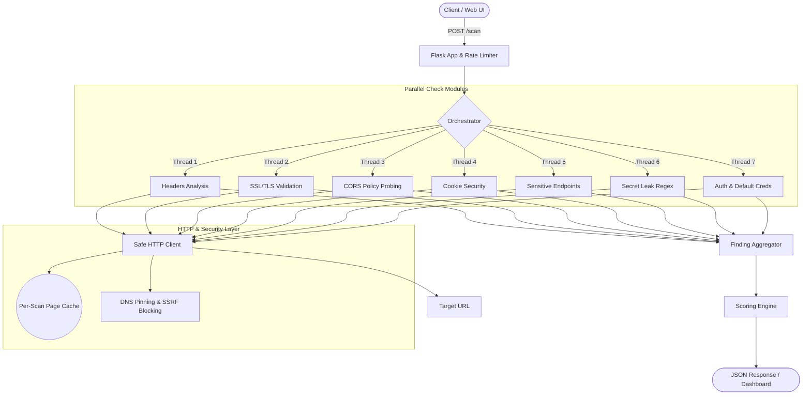

<div align="center">
  
  <h1>WatchDawg</h1>
  <p><strong>A Highly Concurrent, Pre-Deployment Security Linter for Web Applications</strong></p>
</div>

<p align="center">
  WatchDawg is an essential, high-speed security linting tool built for modern web applications. Enter a target URL, launch an automated scan, and receive a comprehensive, actionable report assessing your application's security posture. By identifying misconfigurations across headers, TLS, CORS, cookies, secret leaks, and exposed endpoints, WatchDawg empowers developers to secure their applications seamlessly before production deployment.
</p>

---

## Table of Contents

1. [Key Features](#-key-features)
2. [Technology Stack](#-technology-stack)
3. [Project Structure](#-project-structure)
4. [System Architecture](#-system-architecture)
5. [In-Depth Security Modules](#-in-depth-security-modules)
6. [Scoring & Grading System](#-scoring--grading-system)
7. [Data Models](#-data-models)
8. [API Reference](#-api-reference)
9. [Web Dashboard & CLI](#-web-dashboard--cli)
10. [Configuration Reference](#-configuration-reference)
11. [Installation & Setup](#-installation--setup)
12. [Testing](#-testing)
13. [Production Deployment](#-production-deployment)
14. [Scanner Security](#-scanner-security-protecting-watchdawg)
15. [Limitations & Analysis Context](#-limitations--analysis-context)
16. [Legal & Ethical Use](#-legal--ethical-use)
17. [Troubleshooting](#-troubleshooting)
18. [Extending WatchDawg](#-extending-watchdawg)

---

## Key Features

- **Blazing Fast Concurrency**: Executes 7 distinct security check modules entirely in parallel utilizing Python's `ThreadPoolExecutor`.
- **SSRF-Hardened Engine**: Safely fetches URLs with robust DNS pinning, strict restriction against private/link-local IPs (e.g., `169.254.169.254`), and strict response size caps.
- **Advanced SPA Detection**: Intelligent baseline detection for Single Page Applications (SPAs) to mitigate false positives when routing logic returns 200 OK for generic 404 pages.
- **Production-Ready WSGI**: Shipped natively with the Waitress WSGI server, allowing for robust concurrency and seamless handling of heavy network traffic.
- **Actionable AI Integrations**: Every detected issue comes with detailed evidence, clear remediation steps, and an AI-ready `fix_prompt` that developers can seamlessly paste into code assistants.
- **Smart Analytics**: Employs a weighted grading system (0–100) with a low-severity penalty cap, delivering a realistic assessment of risk.
- **Dual Interfaces**: Features both an interactive web dashboard and a highly scriptable CLI.

---

## Technology Stack

WatchDawg leverages a lean and powerful stack to deliver rapid security linting.

| Layer        | Technology |
|----------------------|------------|
| **Core Framework**  | Python 3.10+, Flask |
| **Networking**    | `requests` wrapped in custom SSRF-safe client |
| **Parsing Engine**  | `beautifulsoup4` |
| **Production Server**| `waitress` (Multi-threaded WSGI) |
| **Rate Limiting**  | `flask-limiter` (In-memory or Redis-backed) |
| **Frontend UI**   | Vanilla HTML, CSS, JavaScript |
| **Testing Suite**  | `pytest`, `responses` |

---

## Project Structure

```
WatchDawg/
├── app.py         # Flask application, routing, and CLI entry point
├── config.py        # Constants: Timeouts, patterns, weights, and endpoints
├── requirements.txt    # Python package dependencies
│
├── core/
│  ├── orchestrator.py   # Thread pool management and final scan compilation
│  ├── http_client.py   # SSRF-hardened request layer + per-scan page cache
│  ├── models.py      # Dataclasses: Finding, ScanResult
│  ├── scorer.py      # Calculates scores (0–100) and letter grades
│  └── formatter.py    # Marshals logic output to RESTful JSON
│
├── checks/
│  ├── headers.py     # Validates HTTP response headers and CSP
│  ├── ssl_tls.py     # Validates TLS configurations and OpenSSL certs
│  ├── cors.py       # Validates Cross-Origin Resource Sharing
│  ├── cookies.py     # Validates Set-Cookie security flags
│  ├── endpoints.py    # Probes sensitive file exposure (.env, .git)
│  ├── secret_leak.py   # Extracts HTML/JS bundles and runs regex pattern matching
│  └── auth_checks.py   # Probes admin routes, API auth, and default credentials
│
├── templates/
│  └── index.html     # Web dashboard layout
│
├── static/
│  ├── style.css      # Dashboard styling
│  └── script.js      # Dashboard DOM manipulation and scanning logic
│
└── tests/         # 330+ Unit and integration tests
  ├── conftest.py
  ├── test_scorer.py
  ├── test_headers.py
  ├── test_cors.py
  ├── test_cookies.py
  ├── test_endpoints.py
  ├── test_secret_leak.py
  ├── test_http_client.py
  └── test_massive.py
```

---

## System Architecture

WatchDawg is engineered for performance, isolating each security check into concurrent workers while maintaining a centralized, SSRF-safe HTTP cache layer.



### How a Scan Works Step-by-Step

1. **Input Validation (`app.py`)**: The engine ensures URLs meet domain pattern constraints.
2. **Cache Initialization (`orchestrator.py`)**: A fresh session is created to isolate cache dependencies per-scan.
3. **Concurrency Execution**: Seven check threads are dispatched via a `ThreadPoolExecutor`, respecting strict per-module timeouts.
4. **Network Access (`http_client.py`)**: The target hostname is resolved dynamically, checked against SSRF IP lists, and pinned to prevent DNS rebinding. Payloads are capped at 5 MB.
5. **Score Processing (`scorer.py`)**: Findings are aggregated. Failed configurations reduce the score based on their critical severity, factoring in a capped penalty for low-severity hits.
6. **Delivery (`formatter.py`)**: A structured JSON payload is generated for the UI or CLI endpoint.

---

## In-Depth Security Modules

### 1. Security Headers (`checks/headers.py`)
Analyzes the main page for critical security headers.
- **Checks:** `Content-Security-Policy`, `Strict-Transport-Security`, `X-Frame-Options`, `X-Content-Type-Options`, `Referrer-Policy`, and `Permissions-Policy`.
- **Smart Logic:** If `X-Frame-Options` is absent but CSP includes `frame-ancestors`, the engine accurately interprets this as a secure, modern mitigation for Clickjacking.

### 2. SSL/TLS Validation (`checks/ssl_tls.py`)
Performs rigorous transport layer analysis.
- **Checks:** Enforces HTTPS usage and HTTP to HTTPS 301/302 redirects.
- **Certificate Validation:** Initiates a direct TLS handshake with the resolved IP (SNI matching) to inspect certificate validity and expiration dates, flagging soon-to-expire or expired certificates.

### 3. CORS Policy Probing (`checks/cors.py`)
Detects risky Cross-Origin Resource Sharing configurations by sending simulated `OPTIONS` and `GET` requests from an untrusted origin (`https://evil.com`).
- **Checks:** Identifies explicit reflection of untrusted origins and flags the highly dangerous combination of `Access-Control-Allow-Origin: *` alongside `Access-Control-Allow-Credentials: true`.

### 4. Cookie Security (`checks/cookies.py`)
Evaluates the flags of all incoming `Set-Cookie` headers.
- **Checks:** `HttpOnly`, `Secure`, and `SameSite`.
- **Context Awareness:** Dynamically differentiates between session/auth cookies (e.g., `token`, `sessionid`) and tracking cookies, adjusting severity scores automatically so developers aren't penalized heavily for non-sensitive analytics cookies missing `HttpOnly`.

### 5. Sensitive Endpoints (`checks/endpoints.py`)
Executes parallel probes against common misconfigurations.
- **Checks:** Attempts access to `/.env`, `/.git/config`, `/backup.sql`, `/phpinfo.php`, `/wp-admin`, and more.
- **SPA False Positive Avoidance:** WatchDawg first queries a random 404 path to capture the baseline response footprint. If a probed sensitive endpoint returns an HTTP 200 but matches the baseline content length (common in React/Vue SPAs), WatchDawg successfully ignores the false positive.

### 6. Secret Leak Detection (`checks/secret_leak.py`)
Safeguards against exposed credentials in frontend source code.
- **Checks:** Scans the core HTML and fetches up to 5 linked JavaScript assets.
- **Detection Patterns:** Employs precise regular expressions to detect AWS Keys, OpenAI API Tokens, Stripe Secrets, GitHub Tokens, and more.
- **Safety:** Redacts discovered secrets in reports (e.g., `sk-live...a8d9`) and intelligently downgrades findings originating from third-party CDNs to `info` severity.

### 7. Authentication Hardening (`checks/auth_checks.py`)
Verifies the integrity of application authentication boundaries.
- **Checks:** 
 - **Admin Routes**: Scans routes like `/admin/dashboard` for unauthenticated HTTP 200 success states.
 - **JSON APIs**: Flags endpoints like `/api/users` that return valid JSON blobs without requiring Authorization headers.
 - **Default Credentials**: Attempts automated logins with common weak credentials (e.g., `admin:admin`) across known login endpoints, monitoring for authentication tokens or successful redirects.

---

## Scoring & Grading System

WatchDawg quantifies security risks with a deterministic grading algorithm that translates complex findings into a developer-friendly letter grade.

### Penalty Weights

| Severity | Description | Penalty |
|----------|-------------|---------|
| **Critical** | Major vulnerabilities (e.g., Exposed `.env`, Expired SSL) | -30 Pts |
| **High** | Significant misconfigurations (e.g., Missing HttpOnly on Auth) | -15 Pts |
| **Medium** | Moderate risks (e.g., Wildcard CORS without credentials) | -7 Pts |
| **Low** | Minor improvements (e.g., Missing Referrer-Policy) | -3 Pts |
| **Info** | Informational findings, false-positive downgrades | 0 Pts |

### Low-Severity Penalty Cap
To prevent minor issues from unjustly skewing the final grade (such as missing optional headers), the cumulative penalty for "Low" severity findings is strictly capped at **15 points**.

### Grade Thresholds

| Grade | Minimum Score |
|-------|--------------|
| **A** | 90+ |
| **B** | 75+ |
| **C** | 60+ |
| **D** | 45+ |
| **F** | Below 45 |

---

## Data Models

### `Finding` Object

The core data class returned by every security module.

```python
@dataclass
class Finding:
  check_name: str    # E.g., "Content-Security-Policy"
  category: str     # Module category ("headers", "ssl", "cors")
  passed: bool     # True if the security check succeeded
  severity: str     # "critical", "high", "medium", "low", "info"
  detail: str      # Human-readable explanation of the issue
  fix: str       # Developer-facing remediation instructions
  evidence: str | None # Redacted proof (headers, status code)
  confidence: str    # "high", "medium", "low"
  is_third_party: bool # True if the finding came from a third-party asset
```

### JSON Response Signature

```json
{
 "url": "https://example.com",
 "score": 74,
 "grade": "C",
 "summary": "2 medium, 4 low issues found — Grade C (74/100)",
 "breakdown": {
  "critical": 0,
  "high": 0,
  "medium": 2,
  "low": 4,
  "info": 0,
  "passed": 7
 },
 "categories": {
  "headers": [
   {
    "check_name": "Content-Security-Policy",
    "passed": false,
    "severity": "medium",
    "detail": "CSP header is missing.",
    "fix": "Implement a Content Security Policy...",
    "evidence": null,
    "confidence": "high",
    "is_third_party": false,
    "fix_prompt": "Fix this security issue: CSP header is missing..."
   }
  ]
 },
 "error": null
}
```

---

## API Reference

WatchDawg provides a lightweight REST API.

### `GET /`
Serves the web dashboard HTML interface.

### `POST /scan`
Initiates a concurrent security scan against the provided target URL.

**Request:**
```http
POST /scan
Content-Type: application/json

{
 "url": "https://example.com"
}
```

**Responses:**
- `200 OK`: Successful scan execution. Returns JSON signature defined in Data Models.
- `400 Bad Request`: Invalid URL formatting or excessively long payload.
- `429 Too Many Requests`: Triggered by strict rate limits.
- `502 Bad Gateway`: Total scan failure from internal orchestration errors.
- `503 Service Unavailable`: Execution pool is saturated.

**Rate Limits:**
- Endpoint `/scan`: 5 Requests per minute (IP based).
- Global: 50 Requests per hour, 200 per day.

---

## Web Dashboard & CLI

WatchDawg offers two robust interfaces.

### The Web Dashboard
Accessed natively via `http://127.0.0.1:5000` when running locally, the dashboard features:
- Dynamic status tracking and real-time frontend scanning logic.
- A "Deployment Checklist" sidebar summarizing rapid action items.
- Extracted code blocks mapped to seamless "Copy AI Fix Prompt" clipboards for IDE pasting.

### CLI Utilities (For CI/CD)

The CLI acts as a wrapper over the scanner, allowing build pipelines to strictly enforce security.
```bash
# General terminal scan
python app.py scan https://example.com

# Dump JSON payload exclusively
python app.py scan https://example.com --json

# Fail continuous integration pipelines if score is lower than threshold
python app.py scan https://example.com --fail-under 80

# Scan local targets bypassing SSRF checks (Development mode)
python app.py scan http://localhost:3000 --allow-localhost
```

---

## Configuration Reference

Operational flags and global behaviors are sourced directly from `config.py`.

### Core Options
- `TIMEOUT` / `CONNECT_TIMEOUT`: Controls strict lifecycle management over network hops.
- `MAX_CONTENT_LENGTH`: Defaulted to 5MB, mitigating denial-of-service risks against the tool itself.

### Thread Timeouts (`CHECK_TIMEOUTS`)
- **Fast operations** (`headers`, `ssl`, `cors`, `cookies`): 20s hard limit.
- **Secret regex**: 45s hard limit.
- **Intensive Probing** (`endpoints`, `auth`): 60s hard limit.

### Environmental Modifiers
- `PORT`: Define specific binding ports (Defaults to 5000).
- `REDIS_URL`: Link a Redis datastore to globally synchronize rate limits across distributed workers.

---

## Installation & Setup

Ensure you have **Python 3.10+** installed.

```bash
# 1. Clone the Repository
git clone https://github.com/Devan433/watchdog.git
cd watchdog

# 2. Initialize a Virtual Environment
python -m venv venv

# Activate Environment
source venv/bin/activate   # macOS / Linux
venv\Scripts\activate     # Windows

# 3. Install Required Dependencies
pip install -r requirements.txt

# 4. Boot the Production Server
python app.py
```
*Access the dashboard locally via `http://127.0.0.1:5000`*

---

## Testing

WatchDawg maintains over 330 dedicated unit and integration tests driven by `pytest` and HTTP mocking via the `responses` library.

### Execution
```bash
# Full test suite execution
python -m pytest tests/ -v

# Run targeted checks
python -m pytest tests/test_cors.py -v
```

### Coverage Matrices

| Module | Test Coverage Summary |
|--------|-----------------------|
| `test_scorer.py` | Accurate grading thresholds, penalty caps, and negative score clamping. |
| `test_massive.py`| Simulates over 300 parameterized scoring permutations ensuring algorithmic consistency. |
| `test_headers.py`| Validates positive/negative presence and fallback logic (e.g., `X-Frame-Options` via `CSP`). |
| `test_cors.py` | Exhaustively routes simulated wildcard configurations and evil-origin reflection behaviors. |
| `test_cookies.py`| Asserts tracking vs. session context differentiation. |
| `test_endpoints.py`| Enforces correct SPA baseline logic rendering and path isolation. |
| `test_secret_leak.py`| Validates robust regex extraction processes across mocked JavaScript payloads. |
| `test_http_client.py`| Asserts DNS pinning integrity, SSRF internal-blocklists, and payload cap enforcements. |

---

## Production Deployment

WatchDawg is engineered to scale globally.

### Single Instance (VPS / Render / Railway)
Simply provide the `PORT` your platform expects. WatchDawg natively spins up via Waitress.
```bash
pip install -r requirements.txt
python app.py
```

### Multi-Node / Containerized Architecture
Link multiple distributed containers securely using Redis for rate-limiting parity.
```bash
export REDIS_URL=redis://your-redis-host:6379
python app.py
```

### Proxy Configurations
WatchDawg embeds `ProxyFix` middleware natively. It respects 1 level of `X-Forwarded-For`, `X-Proto`, `X-Host`, and `X-Prefix` headers, ensuring complete compatibility with Nginx, Cloudflare, and cloud load-balancers out-of-the-box.

---

## Scanner Security (Protecting WatchDawg)

Executing active network checks requires internal hardening. WatchDawg defends itself proactively:

- **SSRF Blocklists**: All URLs have their hostnames actively resolved before a socket opens. Internal network ranges (`127.0.0.0/8`, `10.0.0.0/8`, `192.168.0.0/16`) and critical cloud metadata endpoints (`169.254.169.254`) are forcefully dropped.
- **DNS Pinning**: Connections utilize the exact IP validated against SSRF logic, defending explicitly against DNS rebinding attacks.
- **Reflective XSS Sanitation**: Output dynamically rendered into the dashboard is explicitly HTML-escaped during DOM hydration.

---

## Limitations & Analysis Context

While WatchDawg is highly effective at surfacing critical pre-deployment misconfigurations, specific architectural patterns should be noted:

- **Complex Single Page Applications (SPAs)**: SPAs that heavily obfuscate routing or uniformly return 200 HTTP codes on missing pages rely on WatchDawg's heuristic baseline detection. Extremely non-standard SPA frameworks might require manual endpoint verification.
- **Deep Authentication Layers**: The scanner strictly analyzes unprotected routes, pre-flight APIs, and default credentials on root forms. It does not perform active session hijacking, CSRF token chaining, or bypass CAPTCHAs.
- **Lazy Loaded Assets**: WatchDawg actively fetches and parses up to 5 JavaScript bundles linked dynamically on the entry page. Heavily async or deeply nested payloads may not be recursively explored.

---

## Legal & Ethical Use

WatchDawg is an active verification tool that transmits real HTTP requests—including diagnostic endpoints and authentication forms.

**Strict Mandate:** This tool MUST only be deployed against applications and domain architectures that you explicitly own, operate, or possess documented permission to audit. 
Deploying WatchDawg as a public-facing service necessitates rigorous terms of use enforcement to prevent unauthorized network scanning by third parties.

---

## Troubleshooting

- **Symptom:** `"{check_name} check timed out after 60s"`
 - *Context:* The target application may be exceedingly slow or aggressively throttling connections.
 - *Resolution:* Focus the scanner on specific API subdomains rather than heavy homepage payloads.
- **Symptom:** `503 Server is busy`
 - *Context:* The internal semaphore has reached its 10-concurrent scan limit.
 - *Resolution:* Wait for previous sessions to clear. If self-hosting, modify the WSGI threading limits.
- **Symptom:** `429 Rate limit exceeded`
 - *Context:* Triggered `flask-limiter` by issuing over 5 scans per minute.
 - *Resolution:* Wait 60 seconds before initiating subsequent scans.
- **Symptom:** CLI Localhost Failures
 - *Context:* SSRF protections forcefully prevent local scanning by default.
 - *Resolution:* Append `--allow-localhost` to the CLI command (e.g., `python app.py scan http://localhost:8000 --allow-localhost`).

---

## Extending WatchDawg

Expanding WatchDawg's security coverage is seamlessly supported.

1. **Create the Logic**: Implement a new file inside `checks/` (e.g., `checks/new_check.py`). Provide the expected export signature: `def check_my_feature(url: str) -> list[Finding]:`.
2. **Register the Module**: Incorporate your function into the `checks` execution dictionary within `core/orchestrator.py`.
3. **Configure Timeouts**: Define an appropriate timeout allowance inside `config.py` under `CHECK_TIMEOUTS`.
4. **Leverage the HTTP Client**: Import `safe_request` or `fetch_page` from `core.http_client` to guarantee your new module automatically inherits WatchDawg's native SSRF protection, redirection validation, and caching.

---

<div align="center">
  <strong>Empower Your Pre-Launch Workflow with WatchDawg</strong><br>
  <em>Ensure Security Before You Ship.</em>
</div>
